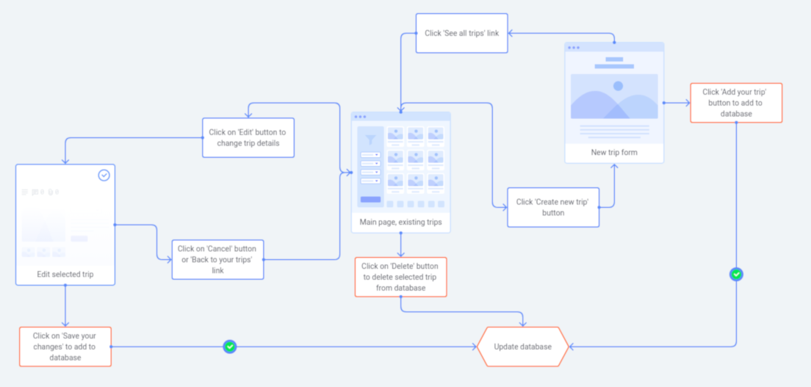
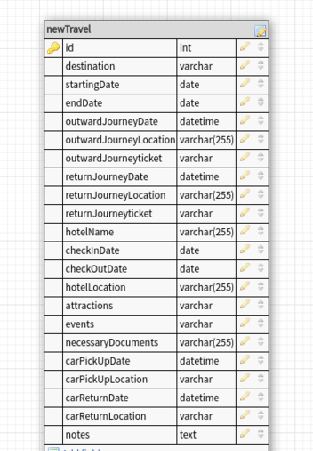
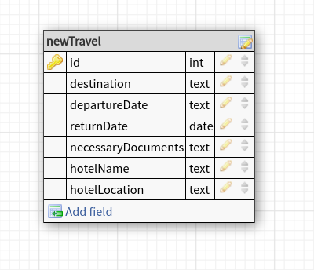
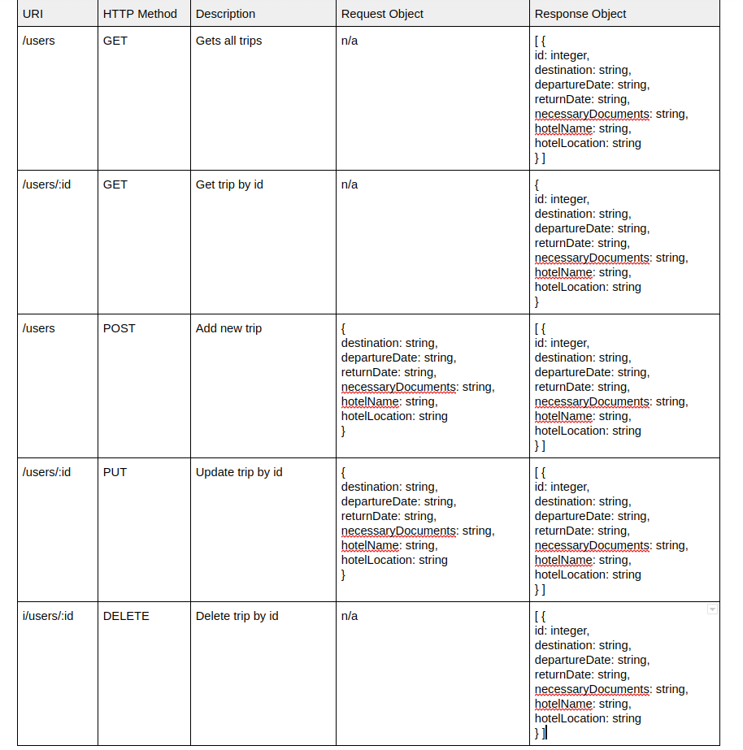

# Travello

Travello is an app that will help a user to plan trips and enable them to see all the information in well organized form.

## User Flow Diagram

## Database schema

- Database contains one table which include basic details about a travel, to keep it as straightforward as possible. Later on the schema may be changed to group related fields in separate tables and also contain more column with more details about trip from user.

This schema shows what kind of user input I was planning to get at the beginning.

Schema below is the actual one I was working on, to simplyify even more.

## API routes plan

## Used technologies

1. MySQL - database
2. Express - to create server and API routes
3. Node.js - to run the server
4. React - Front-end
5. Bootstrap - styling 

## Dependencies 

1. Run `yarn install` in project directory. This will install server's project dependencies such as Express.
2. `cd client` and `yarn install`. This will install client dependencies (React).

## Database preperation

1. Create MySQL database.
2. In your root project folder create *.env* file to keep information about mySQL autentication, DB_HOST, DB_USER, DB_NAME, DB_PASS. In file *database.js* update information according to info in your *.env* file.
3. To create table that will represent the same table I used you need to run `npm run migrate` or `yarn migrate` in your terminal. You can see definition of this table in *database.js* file.

## Future features

1. Display only travel destination and date (and some grafic) after user click the box all details will be revield
2. Sort trips by date (upcoming first)
3. Log in form
4. Map for individual trip to show location of hotel, car rental etc.
5. User can create wish list/ bucket list/ travel inspirations

## Credit

_This is a student project that was created at [CodeOp](http://CodeOp.tech), a full stack development bootcamp in Barcelona._