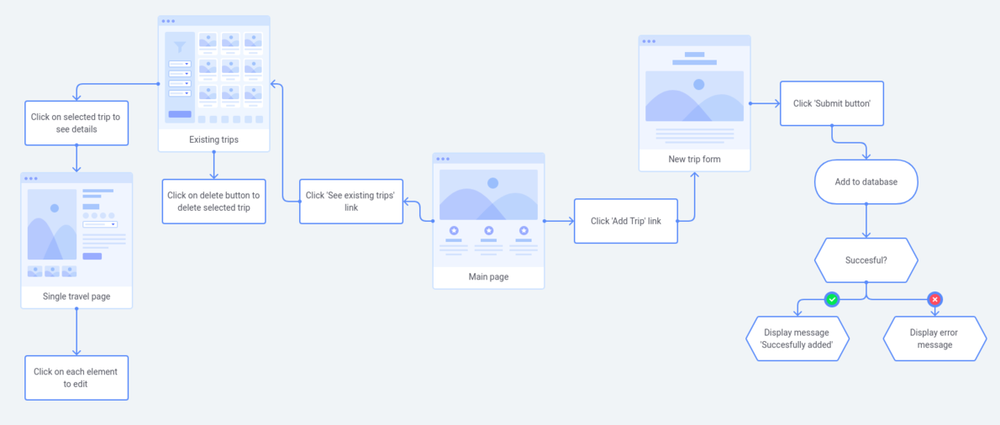

# Travello

Travello is an app that will help a user to plan trips and enable them to see all the information in well organized form.

## User Flow Diagram

## Database schema

- Database will contain one table which will include all details about a travel, to keep it as straightforward as possible. Later on the schema may be changed to group related fields in separate tables.

## API routes plan

## Full stack architecture drawing

## Credit

_This is a student project that was created at [CodeOp](http://CodeOp.tech), a full stack development bootcamp in Barcelona._